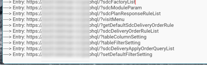

# 编写原因

---

> Metersphere平台可导入postman，har，jmeter，swagger和metersphere的格式，但在尝试所有格式后，选择使用metersphere格式最为合适：metersphere的json格式相对易读，且导入时可以设置test的内容，而其他格式仅仅只能放入api。

# 功能介绍

---

- 通过开始输入的keyword，将捕获的接口过滤，只留有包含keyword的接口
- 去重过滤后的接口，保证只录入一遍
- 将接口实时的保存为metersphere格式的json文件，保存于当前目录

# 使用方法

---

## 选择版本

- m2m提供了三个版本，m2m_m，m2m_i，m2m.exe，分别对应mac M芯片，mac Inter芯片，windows x64三个版本，对应使用的电脑开启响应版本。

- 现已上传pypi，可以直接通过命令行 pip install viewm2m 下载，命令行viewm2m可直接运行。

## 安装并配置SwitchyOmega

- 安装SwitchyOmega
以chrome为例：打开扩展模式后，下载[https://chrome.google.com/webstore/detail/proxy-switchyomega/padekgcemlokbadohgkifijomclgjgif?hl=zh-CN](https://chrome.google.com/webstore/detail/proxy-switchyomega/padekgcemlokbadohgkifijomclgjgif?hl=zh-CN)

    
- 配置SwitchyOmega
点击选项。

    

    创建情景模式

    

    输入如下内容并保存

    

## 运行m2m

- 双击启动m2m
失败场景1：

    

    解决方法1：

    

    失败场景2：

    

    解决方法2：

    用chmod 777 文件名赋予文件可执行权限

    

    到这个界面时代表监听已打开8083端口

- 启动后默认锁定graphql关键字，可以更改后点击update keywoeds按钮更新关键字

- Update Keywoeds按钮
    - 点击后会根据输入框的文字更新监听关键字。
    - 点击后会删除json之前的所有内容，重新写入。
- Entry按钮
    - 未点击状态，只会监听当前过滤的接口并显示，并不会录入到mitm2mester.json文件中

    

    - 点击Entry按钮后，按钮会变成蓝色，之后捕获的接口会存入mitm2meter.json文件中

    

打开浏览器代理

## 安装证书（首次）

在开启了m2m以及浏览器代理之后，在输入框输入mitm.it

根据系统不同get不同的证书

-  windows证书安装

双击mitmproxy-ca.p12进入导入证书的页面，点击“下一步”

不用输入密码，直接“下一步”

选择“将所有的证书都放入下列存储”，接着选择“受信任的根证书颁发机构”

最后，弹出警告窗口，直接点击“是”

- mac
Mac 下双击 mitmproxy-ca-cert.pem 即可弹出钥匙串管理页面，然后找到 mitmproxy 证书，点击打开其设置选项，选择始终信任即可

    

## 捕获接口

- entry后为录入的接口

  
  m2m会在**桌面**实时生成json文件mitm2meter.json，该文件为持续覆盖状态，再次开启m2m会覆盖这个文件，若需要保存上次的录制，请将上次的mitm2meter.json文件转移至其他目录。

## 导入到Metersphere平台

> 接口测试→接口定义→更多操作→导入→格式选择Metersphere上传mitm2meter.json文件点击保存即可

